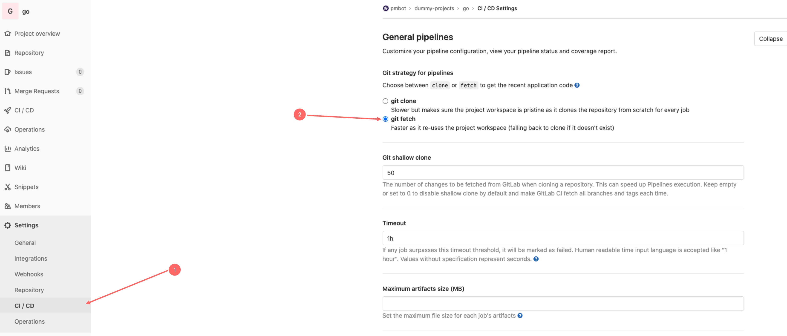

# Gitlab CI

<div class="blockquote" data-props='{ "mod": "warning" }'>

If you're looking for the Gitlab **git** provider documentation, go to [Git Providers / Gitlab](../git-providers/gitlab).

</div>

## Provider settings

| Field | Description |
| --- | --- |
| Name | The name of your CI provider |
| Gitlab URL | The URL of your Gitlab instance. You must turn on the **self hosted** toggle for this parameter to be visible. |

## Project settings

| Field | Description |
| --- | --- |
| Gitlab project ID | The ID of your Gitlab project, available under **Settings / General** in your Gitlab project. |
| Pipeline trigger token | This token allows Pmbot to trigger a pipeline in Gitlab CI. You can created them in **Settings / CI/CD / Pipeline Triggers** in your Gitlab project. Checkout [the official Gitlab docs](https://docs.gitlab.com/ee/ci/triggers/#adding-a-new-trigger) for more info. |

## Project Setup

Running Pmbot on Gitlab CI is made easy thanks to Gitlab webhooks and a feature rich CI configuration file.

### CI config file

You'll need to update in your `.gitlab-ci.yml`. 

The variables marked with `{{...}}` are prefilled in the code snippets provided in your [project setup](/core/projects#setup).

| Variable | Description |
| --- | --- |
| `{{PMBOT_URL}}` | The URL of the Pmbot backend. |
| `{{PMBOT_PROJECT_ID}}` | The ID of your Pmbot project. You can find this ID in the URL of your UI when you are on the project details page. |
| `{{PMBOT_TOKEN}}` | Your [`PMBOT_TOKEN`](#pmbot_token) |

Here is an example for updating Npm dependencies:

<div class="code-group" data-props='{ "lineNumbers": [true], "labels": [".gitlab-ci.yml"] }'>

```yaml
stages:
  - update
  - test
  # must be the last stage !
  - notify

variables:
  PMBOT_URL: {{PMBOT_URL}}
  PMBOT_PROJECT_ID: {{PMBOT_PROJECT_ID}}
  # !!!!! place this in a secret CI/CD variable !!!!!
  # https://docs.gitlab.com/ee/ci/variables/#create-a-custom-variable-in-the-ui
  PROJECT_TOKEN: {{PROJECT_TOKEN}}

update:
  stage: update
  image: pmbot/bot
  # run the update job only when variable environment $PMBOT is "true"
  only:
    variables:
      - $PMBOT == "true"
  script:
    # install your dependencies
    - npm ci
    # run the update
    - pmbot update --url https://pmbot.company.com

# your existing build/test jobs
test:
  stage: test
  image: node:12-alpine
  # skip this job when running the update job
  except:
    variables:
      - $PMBOT == "true"
  script:
    - npm ci
    - npm test

# notify pmbot of pipeline success
on-success:
  stage: notify
  image: pmbot/bot
  when: on_success
  script:
    - pmbot notify --success

# notify pmbot of pipeline success
on-failure:
  stage: notify
  image: pmbot/bot
  when: on_failure
  script:
    - pmbot notify

```

</div>

<div class="blockquote" data-props='{ "mod": "info" }'>

`on-success` and `on-failure` are separate jobs because Gitlab CI does not provide a pipeline status variable in the [predefined environment variables](https://docs.gitlab.com/ee/ci/variables/predefined_variables.html). 

</div>

## Self signed certificates

See [`here`](/core/cli#self-signed-certificates).

We recommend setting a [CI/CD variable](https://docs.gitlab.com/ee/ci/variables/) of type [**file**](https://docs.gitlab.com/ee/ci/variables/#custom-environment-variables-of-type-file) at [the group level](https://docs.gitlab.com/ee/ci/variables/#group-level-environment-variables) or the [instance level]() with the path to your CA certificate.

## Untracked files errors in Gitlab CI

If you forced push to the update source branch, for example `master`, you may experience issues where Git throws an error as the bot tries to `checkout` the update branch. You can work around this problem as follows:

1. Go to your Gitlab project **CI/CD settings**
2. In the **General** section, under **Git strategy for pipelines**, select **Git clone** and then **save** the form.

This will ensure that the workspace is clean for each run.



## Group level and global variables

Did you know that you can set CI variables at [the group level](https://docs.gitlab.com/ee/ci/variables/) and [the instance level](https://docs.gitlab.com/ee/ci/variables/#instance-level-cicd-environment-variables) (new in Gitlab 13) ? This will help you speed up setup for projects by providing globally things like trusted CA and, for example, global CLI options. 
